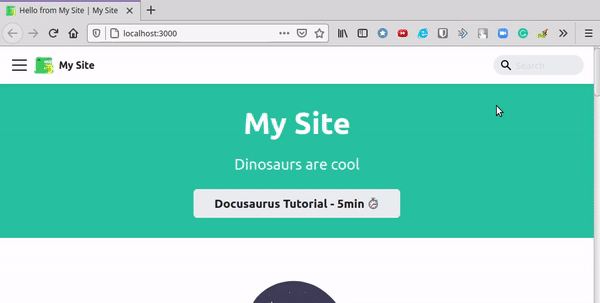

## Docusaurus custom search


This component is custom search bar for docusaurus. This search keywords by parsing values at search bar and making search with lunr js in each document's .md or .mdx files.

### Node modules to be prepared
`sudo npm install lunr classnames`

### How to use it
First, docusaurus app should be installed. The [docusaurus repo is here](https://github.com/facebook/docusaurus).

Docusaurus website should be [installed](https://github.com/facebook/docusaurus#installation) like,

```
npx @docusaurus/init@latest init [name] [template]
``` 

Because blog `.md` or `.mdx` files have date format to be parsed as paths which can be written in `[docusaurus website dir]/.docusaurus/client-manifest.json`. This json file is made by command above.

Second, this SearchBar dir goes into `[docusaurus website dir]/src/theme`. This repo will be uses as a component on docusaurus website. [Example docusaurus website is here](https://github.com/jacobkim9881/custom-search-docu-demon). 

Third, install required node modules like,

`sudo npm install lunr classnames`

Last, install docusaurus website by commanding,

`sudo npm run build`
